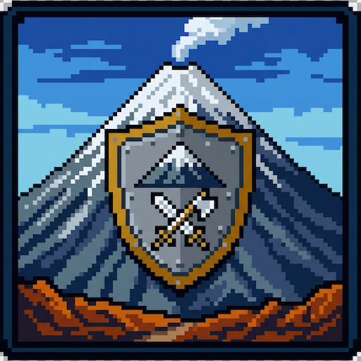

<div align="center">



# Teidefender

**Arcade 2D estilo Pac-Man con un mensaje ecológico: defiende el Parque Nacional del Teide.**

[](https://teidefender.kiaramaldonado.com)
[](https://godotengine.org)
[]()
[](https://silentwolf.com)

</div>

---

## 🌋 Sobre el juego

Encarnas a **Acorán, el Guardián**, un guarda forestal del Parque Nacional del Teide que debe defender el parque de tres turistas irresponsables:

- 📸 **Spencer** (la influencer): te persigue para sacarse selfies. Si te alcanza, te flashea con la cámara y te bloquea la vista durante unos segundos.
- 👊 **Tato** (el niñato): se pasea desafiante. Si te coge cerca, te suelta un puñetazo (−100 puntos).
- 🪴 **Homero** (el jardinero): pasea con su bolsa plantando **Violetas del Teide** (flora endémica). Si las pisas pierdes 50 puntos.

Tu objetivo: **recoger la basura** (cáscaras, latas, papeles) que aparece por el laberinto antes de que se acumule demasiada. Si la integridad del parque cae a 0, has fallado en tu misión.

> **¿Por qué Teidefender?** El juego busca concienciar de forma divertida sobre la importancia de cuidar los espacios naturales canarios — Patrimonio de la Humanidad por la UNESCO.

---

## ✨ Características destacadas

- 🌀 **Laberinto Pac-Man** con IA cardinal por cuadrícula
- 🧠 **Pathfinding BFS** propio (sin `NavigationAgent2D`)
- 🏆 **Ranking online global** vía [SilentWolf](https://silentwolf.com)
- 📈 **Dificultad estilo Tetris** (crece exponencialmente con tus puntos)
- ☕ **Power-up barraquito** (café canario) con timer acumulable
- 🎬 **Cuenta atrás 3-2-1-¡Vamos!** al iniciar partida
- 🎵 **Banda sonora folk canaria** generada con IA
- 🌐 **Exportado a Web**: jugable en cualquier navegador, sin instalar nada

---

## 🎮 Controles

| Tecla       | Acción            |
| ----------- | ----------------- |
| ⬆️ ⬇️ ⬅️ ➡️ | Mover a Acorán    |
| `Esc`       | Pausar / reanudar |
| 🖱️          | Navegar menús     |

---

## 🚀 Jugar

### Online (recomendado)

Sin instalación, desde el navegador → **<https://teidefender.kiaramaldonado.com>**

### Local (desarrollo)

1. Clona el repositorio:
   ```bash
   git clone https://github.com/kiaramaldonado/teidefender.git
   cd teidefender
   ```
2. Instala [Godot 4.6.2](https://godotengine.org/download).
3. (Opcional) Configura el ranking — ver siguiente sección.
4. Abre el proyecto en Godot y pulsa **F5**.

---

## 🔑 Configurar SilentWolf (opcional)

El ranking online requiere credenciales privadas (no incluidas en el repositorio):

1. Crea una cuenta gratuita en [silentwolf.com](https://silentwolf.com).
2. Copia la plantilla:
   ```bash
   cp config/silent_wolf.cfg.example config/silent_wolf.cfg
   ```
3. Rellena `config/silent_wolf.cfg` con tu `api_key` y `game_id`.

Si omites este paso, el juego funciona igualmente pero el ranking estará desactivado.

---

## 🛠️ Arquitectura técnica

### Escenas principales

| Escena                                                       | Rol                                             |
| ------------------------------------------------------------ | ----------------------------------------------- |
| `MenuPrincipal.tscn`                                         | Entrada del juego, input de nombre, navegación  |
| `Mundo.tscn`                                                 | Nivel jugable, HUD, menú de pausa, cuenta atrás |
| `Ranking.tscn`                                               | Top 20 de SilentWolf                            |
| `GameOver.tscn`                                              | Resultado final + envío al ranking              |
| `Jugador.tscn`, `Spencer.tscn`, `Tato.tscn`, `Homero.tscn`   | Personajes                                      |
| `Basura.tscn`, `VioletaTeide.tscn`, `PowerUpBarraquito.tscn` | Items                                           |

### Autoloads (singletons globales)

| Autoload        | Para qué                                                   |
| --------------- | ---------------------------------------------------------- |
| `SilentWolf`    | Addon de terceros — ranking online                         |
| `PlayerSession` | Datos de sesión + configuración de SilentWolf con timeouts |
| `MenuMusic`     | Música del menú persistente entre escenas                  |
| `UISounds`      | Sonido hover universal en cualquier `BaseButton`           |

### Sistema de IA

- `Maze.gd` define el laberinto como un array de strings (`#` = pared, `.` = corredor) en una rejilla 19×11 de celdas de 64 px.
- Los enemigos se mueven **celda a celda** en direcciones cardinales.
- **Spencer** usa `Maze.direction_towards()` (BFS) para perseguir al jugador siempre por el camino más corto.
- **Tato** y **Homero** son _random walkers_ que evitan dar media vuelta.

### Sistema de puntos

```
Puntuación = (Basura × 25) − (Violetas × 50) − (Puñetazos × 100)
```

Empiezas con 200 puntos. Pierdes si los puntos llegan a 0 **o** si la integridad del parque baja al 0 % (24 bolsas acumuladas).

### Dificultad escalonada (estilo Tetris)

Cada 250 puntos sube un nivel. Dos factores escalan:

- `factor_spawn = 1.12^nivel` (sin tope) → acorta el intervalo de aparición.
- `factor_enemigo = min(1.07^nivel, 1.4)` (con techo) → acelera enemigos hasta el límite.

---

## 📦 Exportar a Web

```bash
# 1) Instalar plantillas oficiales desde Editor → Manage Export Templates
# 2) Exportar (headless)
godot --headless --export-release "teidefender" build/web/index.html
```

Genera 9 ficheros en `build/web/` (HTML, JS, WASM, PCK, worklets de audio, iconos). Súbelos a cualquier hosting estático (Cloudflare Pages, Netlify, Vercel…).

El preset usa `variant/thread_support = false` para no requerir cabeceras COOP/COEP.

---

## 🗂️ Estructura del proyecto

```
teidefender/
├── addons/silent_wolf/      Addon del ranking online
├── config/                  Configuración (.cfg ignorado por git)
├── escenas/                 Escenas .tscn
├── scripts/                 Lógica del juego en GDScript
├── sprites/                 Pixel art (personajes, items, UI)
├── sonidos/                 Música y efectos
├── fondos/                  Fondos del menú y del nivel
├── fuentes/                 Tipografía PixelifySans
├── build/web/               Export web (ignorado por git)
└── teidefender_logo.png     Icono del proyecto
```

---

## 📚 Stack tecnológico

| Categoría            | Herramientas                                                                              |
| -------------------- | ----------------------------------------------------------------------------------------- |
| Motor                | [Godot Engine 4.6.2](https://godotengine.org)                                             |
| Lenguaje             | GDScript                                                                                  |
| Pixel art            | [PixelLab.ai](https://pixellab.ai)                                                        |
| Música               | Suno + IA Lyria 3 (folk canaria)                                                          |
| Ranking online       | [SilentWolf](https://silentwolf.com)                                                      |
| Despliegue           | [Cloudflare Pages](https://pages.cloudflare.com)                                          |
| Vallas del laberinto | [Cute Fantasy tileset](https://kenmi-art.itch.io/cute-fantasy-rpg) (gratuito, modificado) |

---

## 🎓 Contexto académico

Proyecto desarrollado para la asignatura **Programación Multimedia y Dispositivos Móviles** (2º DAM, 2026) — Salesianos La Cuesta.

---

## 👤 Autora

**Kiara Maldonado**

[](https://kiaramaldonado.com)
[](https://github.com/kiaramaldonado)

---

## 📜 Licencia

Proyecto académico. Los recursos de terceros utilizados (Cute Fantasy tileset, SilentWolf) mantienen su licencia original.

<div align="center">

🌋 **Cuida los parques canarios. Son nuestra tierra.**

</div>
